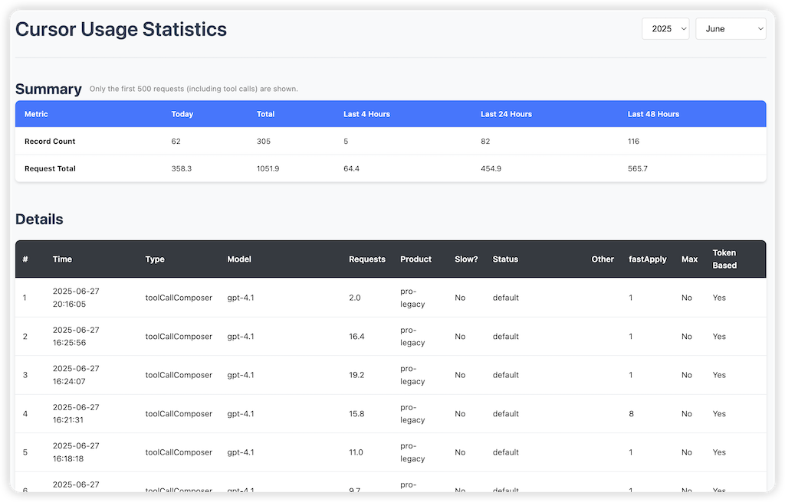

# Cursor Usage Details Chrome Extension

A Chrome extension that provides detailed usage statistics for Cursor.

## Features

- Blue circle indicator on cursor.com/dashboard?tab=usage page
- Detailed usage statistics with summary and detailed tables
- Monthly data filtering with year/month selectors
- Clean, modern UI with proper highlighting for special cases

## Installation

1. Open Chrome and go to `chrome://extensions/`
2. Enable "Developer mode"
3. Click "Load unpacked" and select this directory

## Usage

1. Navigate to `https://www.cursor.com/dashboard?tab=usage`
2. Click the blue circle in the top-right corner
3. View your detailed usage statistics in the new tab

## Project Prompt & Guide

The full prompt/specification used to create this extension is available in [CHROME_EXTENSION_GUIDE.md](./CHROME_EXTENSION_GUIDE.md). This document describes the requirements, data processing, and UI logic in detail.

## Files

- `manifest.json` - Extension configuration
- `content.js` - Injects blue circle on Cursor dashboard
- `usage.html/js/css` - Main usage statistics interface
- `background.js` - Service worker
- `CHROME_EXTENSION_GUIDE.md` - Full prompt/specification for this project

## Requirements

- Chrome browser
- Access to cursor.com (authentication handled automatically)

## License

MIT License. See [LICENSE](./LICENSE) for details. 