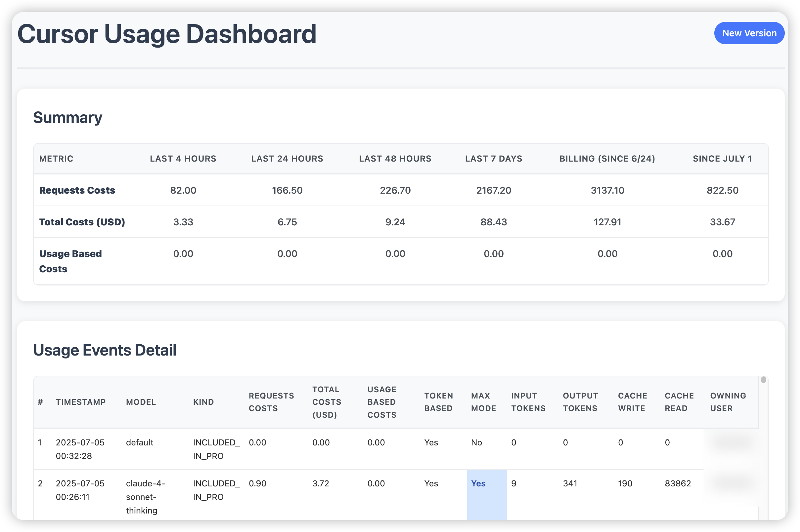

# Cursor Usage Details Chrome Extension

A Chrome extension that provides detailed usage statistics for Cursor with two different versions.

## Features

### Version 1 (Old)
- **API Limitations**: Uses legacy monthly invoice API that returns maximum 500 events per calendar month
- **Data Scope**: Monthly data filtering with year/month selectors only
- **Summary**: Basic record counts and request totals
- **Features**: Simple detailed table with event information
- **UI**: Clean, modern interface with highlighting for special cases

### Version 2 (New)
- **API Capabilities**: Uses advanced filtered usage events API with full pagination support
- **Data Access**: Can fetch all events starting from current billing cycle date to present
- **Real-time Processing**: Fetches all events from billing cycle start to current time (no calendar month restrictions)
- **Advanced Features**:
  - Live progress feedback during data fetching
  - Sticky table headers for better navigation
  - Visual highlighting for max mode events
  - Billing cycle date display
  - Comprehensive time-based aggregations (4h, 24h, 48h, 7d, billing month, calendar month)
- **Data Details**: Raw usage events with complete token information and cost breakdown
- **Performance**: Sequential pagination with progress updates (300 events per page)

### Version 2.1 (Latest - Caching & Performance)
- **Local Caching**: IndexedDB-based caching system for significantly faster subsequent loads
- **Smart Data Synchronization**: Only fetches new/updated data from server, preserving historical data locally
- **Cache Management**: User controls to clear current month's cache or all cache data, located in the top right corner of the header, inline and smaller
- **Details Table Paging**: Supports paging for large datasets, with a page size dropdown (10, 50, 200, 500; default 10). 

## Installation

1. Open Chrome and go to `chrome://extensions/`
2. Enable "Developer mode"
3. Click "Load unpacked" and select this directory

## Usage

**Two ways to access your usage statistics:**

1. **Extension Icon**: Click the extension icon in your browser toolbar to open the **new version** directly
2. **Blue Circle**: Navigate to `https://cursor.com/dashboard` and click the blue circle in the top-right corner, then choose:
   - **"old"** - Opens the original monthly statistics page
   - **"new"** - Opens the advanced dashboard with real-time data

**Key Difference**: The old version can fetch up to 500 events for every calendar month, while the new version fetches all events starting from the current billing cycle date. For users with high usage, the new version provides complete data visibility that the old version cannot match.

## Project Prompt & Guide

The full prompt/specification used to create this extension is available in [CHROME_EXTENSION_GUIDE.md](./CHROME_EXTENSION_GUIDE.md). This document describes the requirements, data processing, and UI logic in detail.

The PRD specification for Version 2 (new version) is available in [Cursor Usage Detail Extension PRD & Implementation Plan.md](./Cursor%20Usage%20Detail%20Extension%20PRD%20%26%20Implementation%20Plan.md).

The PRD specification for Version 2.1 (caching & performance enhancements) is available in [PRD V2.1 - Caching & Performance Enhancements.md](./PRD%20V2.1%20-%20Caching%20%26%20Performance%20Enhancements.md). This document outlines the caching implementation and performance improvements.

## Files

- `manifest.json` - Extension configuration
- `content.js` - Injects blue circle on Cursor dashboard with popup menu
- `usage.html/js/css` - Original usage statistics interface (Version 1)
- `dashboard.html/js/css` - Advanced dashboard interface (Version 2)
- `background.js` - Service worker with icon click handler
- `CHROME_EXTENSION_GUIDE.md` - Full prompt/specification for Version 1
- `Cursor Usage Detail Extension PRD & Implementation Plan.md` - PRD specification for Version 2
- `PRD V2.1 - Caching & Performance Enhancements.md` - PRD specification for Version 2.1

## Requirements

- Chrome browser
- Access to cursor.com (authentication handled automatically)

## License

MIT License. See [LICENSE](./LICENSE) for details. 